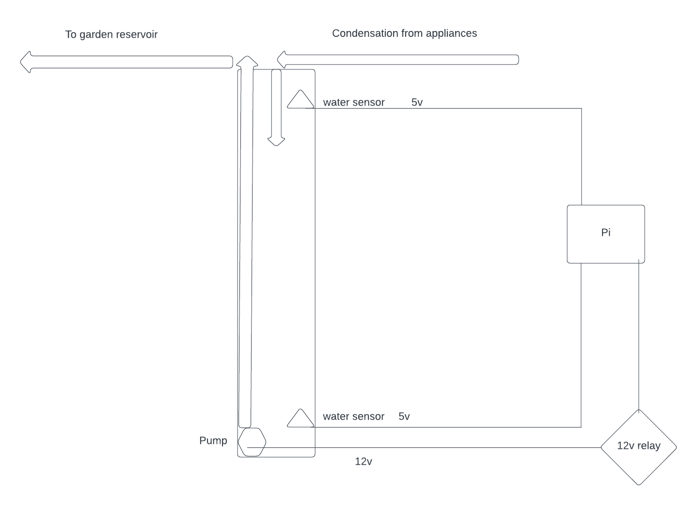

# rpsump

Turn your Raspberry Pi into a sump pump!

## Overview

This particular sump pump was designed to prevent lawn damage due to moisture output from residential heaters and A/C units. The water from the appliances is routed to the sump where the Pi monitors the water level sensors and operates the pump when needed.

Later stages of this application will output the reclaimed water to a reservoir where it will be used for gardening; the Pi will also control the watering schedule.

## Components

##### Board
This struct collects the hardware interfaces and is intended to be a singleton for the lifetime of the program. Other threads can read the state of inputs or change outputs via synchronous access (Mutex).

##### Input pins
Are configured with a callback that triggers when the state changes between high and low. These callbacks send messages that aggregate in the consumer of an mpsc channel for processing.

##### Output pins
Controlled by the mpsc consumer, the state of output pins is computed.

##### Sump
Group of inputs/callback handlers and outputs that form the sump pump functionality.

