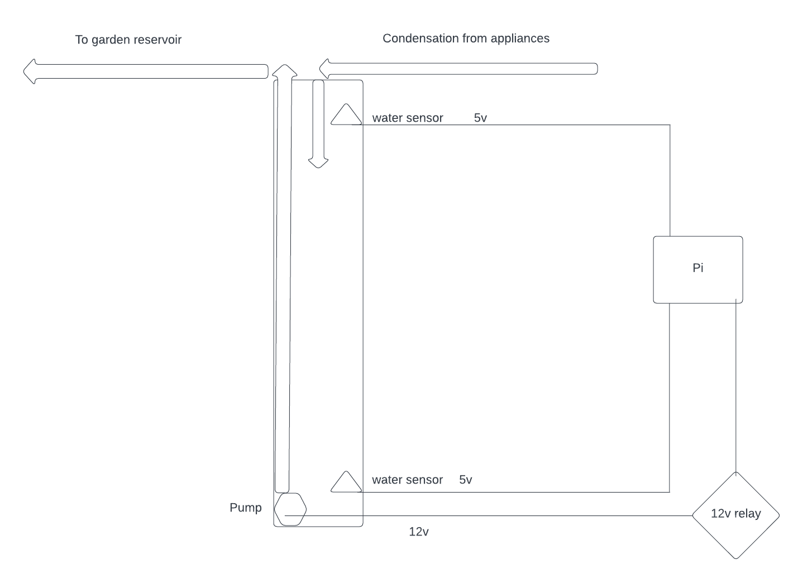

# rpsump

Residential appliance automation with the Raspberry Pi. 

## Overview

This particular sump pump was designed to prevent lawn damage due to moisture output from residential heaters and A/C units. The water from the appliances is routed to the sump where the Pi monitors the water level sensors and operates the pump when needed.

Later stages of this application will output the reclaimed water to a reservoir where it will be used for gardening; the Pi will also control the watering schedule.

## Requirements

SQlite >= 3.35: `sudo apt-get install libsqlite3-dev`

OpenSSL: `sudo apt install libssl-dev`

## Components

##### Board

This struct collects the hardware interfaces and is intended to be a singleton for the lifetime of the program. Other threads can read the state of inputs or change outputs via synchronous access (Mutex).

##### Input pins

Are configured with a callback that triggers when the state changes between high and low. These callbacks send messages that aggregate in the consumer of an mpsc channel for processing.

##### Output pins

Controlled by the mpsc consumer, the state of output pins is computed.

##### Sump

Group of inputs/callback handlers and outputs that form the sump pump functionality.

## Precipitation-aware garden schedules

When the weather feature is enabled, the garden scheduler will skip a
scheduled run if it has rained recently, is currently raining, or is forecast
to rain soon. Schedules can opt out individually (e.g. for covered or indoor
zones) by setting `skip_on_rain = false` on the schedule (the default for
new schedules is `true`). When a run is skipped, a `GardenEvent` row is
written with status `skipped` instead of `queued`, so the event history
reflects why nothing ran.

### How the skip decision works

For every scheduler tick, the system fetches an hourly precipitation reading
from [Open-Meteo](https://open-meteo.com/) (`past_hours` of observations
plus `forecast_hours` of forecast in one request) and builds a snapshot:

- `past_mm` — total observed precipitation over the last `past_hours` hours
- `current_mm` — precipitation for the in-progress hour (used as an
  actively-raining sensor)
- `forecast_mm` — total forecast precipitation over the next `forecast_hours`
  hours after the current hour

A schedule's run is skipped when:

1. The snapshot is available, and the schedule has `skip_on_rain = true`, and
2. **either** `current_mm >= active_rain_mm` (it's actively raining)
3. **or** `past_mm + forecast_weight * forecast_mm >= threshold_mm`

The forecast is intentionally discounted by `forecast_weight` (default
`0.5`) since observations are more reliable than predictions. If the
Open-Meteo request fails or the feature is disabled, the snapshot is marked
unavailable and no schedules are skipped — better to over-water than to dry
out a bed because an API was down.

### Config knobs

| Knob               | Default | Meaning                                               |
|--------------------|---------|-------------------------------------------------------|
| `WEATHER_ENABLED`  | `false` | Master switch; when off, nothing is ever skipped      |
| `WEATHER_LATITUDE` / `WEATHER_LONGITUDE` | —    | Location used for the Open-Meteo query           |
| `WEATHER_PAST_HOURS`     | `24`    | Hours of observed precipitation to total              |
| `WEATHER_FORECAST_HOURS` | `12`    | Hours of forecast to total (after the current hour)   |
| `WEATHER_THRESHOLD_MM`   | `5.0`   | Composite skip threshold for past + weighted forecast |
| `WEATHER_FORECAST_WEIGHT`| `0.5`   | Discount applied to forecast vs. observed             |
| `WEATHER_ACTIVE_RAIN_MM` | `0.3`   | Current-hour mm above which "it is raining now"       |
| `WEATHER_CACHE_TTL_SECS` | `900`   | How long to reuse a snapshot between scheduler ticks  |

`skip_on_rain` is a per-schedule boolean column on `garden_schedule`
(defaults to `true` for new schedules), so multi-zone gardens can mix
uncovered beds with rain-immune zones.

## Hardware

##### Raspberry Pi

- RPi 3 Model B

- 12v Relay

##### Pump Reservoir

- 4in. sewer pipe assembly from retail home improvement store
- standard pvc cement

##### Sensor and pump assembly

- 5v float switches
- aquarium pump
- flexible pvc
- hobby-grade acrylic sheet
- zip ties

